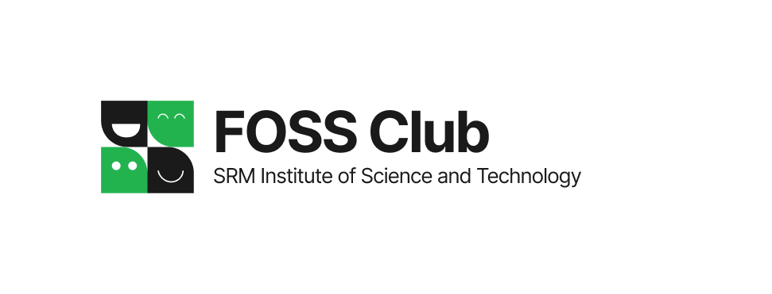

# 🌐 FOSS Club SRM

<div align="center">



### The official open-source student community affiliated with [FOSS United](https://fossunited.org) at SRMIST, Kattankulathur.

</div>

---

## 📖 Overview

The **FOSS Club SRM Web Platform** is an immersive, high-performance web experience built for the open-source developer collective at SRM Institute of Science and Technology. Designed with an obsidian hacker aesthetic, terminal workflows, and interactive 3D graphics, the platform serves as the central hub for events, team roster tracking across academic years, recruitments, and club initiatives.

---

## ✨ Key Features

### 💻 Developer-First UI & 3D Visuals
- **Interactive Workstation Hero**: Embedded terminal shell preview with realistic CLI interaction and procedural sound synthesis.
- **3D Past Events & Technology Wheel**: Three.js 3D cylindrical scroller showcasing club archives and toolchains with mouse-drag interaction and responsive mobile layout.
- **Particle Cosmic Starfield**: GPU-accelerated canvas particles with interactive cursor proximity grid matrix.
- **Synthesized Audio**: Low-latency Web Audio API sound effects for clicks, transitions, and successful CMS operations.

### 👥 Team Hierarchy & Archive (`/team`)
- **Multi-Year Position Tracking**: Tracks club members across academic years (e.g., Volunteer in 2024-25 → Maintainer in 2025-26).
- **Domain Segmentation**: Filter across **Technical**, **Corporate**, and **Creative** domains.
- **Rank Hierarchy**: Visual hierarchy ordering (**Head of Club** > **Maintainer** > **Volunteer**).
- **Direct Socials**: Verified LinkedIn, Instagram, and GitHub profiles.

### 📅 Events Hub (`/events`)
- Dual-mode visualization: Interactive **Grid Cards** and high-density **Archive List view**.
- Real-time distinction between **Upcoming Registrations** and **Past Events**.
- Category badges (Hackathons, CTFs, Workshops, Ideathons).

### 🚀 Recruitment Portal (`/recruitments`)
- Live recruitment status switch with countdown timer.
- Detailed domain descriptions, perks, and eligibility requirements.
- Interactive FAQ accordion and applicant notification subscription.

### 🛠️ Embedded Headless CMS (`/cms`)
- Secured admin dashboard with JWT authentication in HTTP-only cookies.
- **Team Manager**: Add/edit/delete members, paste ImageKit URLs with live preview, manage position history.
- **Events Manager**: Create and update events, manage banner posters and registration links.
- **Recruitment Manager**: Toggle applications, edit domains, perks, FAQs, and export email subscriber lists.
- **Zero-Config Fallback**: Automatic persistent local JSON database fallback when MongoDB is not connected.

---

## 🛠️ Tech Stack

- **Framework**: [Next.js 14](https://nextjs.org/) (App Router, Server Components & Route Handlers)
- **Language**: [TypeScript 5](https://www.typescriptlang.org/)
- **Styling**: [Tailwind CSS](https://tailwindcss.com/), PostCSS, Lucide React icons
- **Animations & 3D**: [Three.js](https://threejs.org/), [Framer Motion](https://www.framer.com/motion/), HTML5 Canvas
- **Database**: [MongoDB](https://www.mongodb.com/) (native driver) with automatic local `.data/` JSON fallback
- **Authentication**: Stateless JSON Web Tokens (`jsonwebtoken`) via HTTP-only cookies
- **Audio Engine**: Web Audio API (zero external sound asset dependencies)

---

## 🚀 Getting Started

### 1. Prerequisites
- **Node.js**: v18.17.0 or higher
- **npm**, **pnpm**, or **yarn**
- **Git**

### 2. Clone the Repository
```bash
git clone https://github.com/fossclubsrm/foss-club-srm.git
cd foss-club-srm
```

### 3. Install Dependencies
```bash
npm install
```

### 4. Configure Environment Variables
Copy the example environment configuration:
```bash
cp .env.local.example .env.local
```

Edit `.env.local` with your values:
```env
# CMS Admin Authentication
CMS_ADMIN_USER=admin
CMS_ADMIN_PASSWORD=your_secure_password
CMS_JWT_SECRET=your_super_secret_jwt_key_here

# Site URL
NEXT_PUBLIC_SITE_URL=http://localhost:3000

# Database (Optional: falls back to local JSON db if unset)
MONGODB_URI=mongodb+srv://<user>:<password>@cluster.mongodb.net/foss_db?retryWrites=true&w=majority
```

### 5. Run the Development Server
```bash
npm run dev
```
Open [http://localhost:3000](http://localhost:3000) in your browser.

---

## 📂 Project Structure

```
├── .data/                      # Local JSON database fallback (when MongoDB is unset)
├── public/
│   └── images/
│       ├── foss-logos/         # Open-source technology SVGs (Docker, Linux, Rust, etc.)
│       ├── logo.png            # Club square logo
│       ├── logo-transparent.png# Transparent navbar/footer icon
│       └── logo-horizontal.png # Club banner logo
├── src/
│   ├── app/
│   │   ├── api/                # Next.js Route Handlers (Auth, Team, Events, Recruitment)
│   │   ├── cms/                # Admin Content Management System pages
│   │   ├── events/             # Events page & archive
│   │   ├── recruitments/       # Recruitment application & FAQ page
│   │   ├── team/               # Team roster with year/domain filters
│   │   ├── globals.css         # Tailwind directives and custom utility classes
│   │   ├── layout.tsx          # Root layout, meta tags, and global background canvas
│   │   └── page.tsx            # Homepage with Workstation Hero & 3D Wheel
│   ├── components/
│   │   ├── 3d/                 # Three.js canvases, particle field, floating logos
│   │   ├── cms/                # CMS admin managers (Team, Events, Recruitment)
│   │   ├── home/               # Hero workstation, technology wheel, IDE inspector
│   │   ├── layout/             # Pill Navbar, Footer, Cursor glow
│   │   └── ui/                 # Reusable buttons, cards, snow particles, text effects
│   ├── lib/
│   │   ├── auth.ts             # JWT token generation, verification & cookies
│   │   ├── db.ts               # Unified MongoDB client with JSON fallback storage
│   │   ├── initialData.ts      # Seed data for initial deployment
│   │   └── sound.ts            # Web Audio API procedural sound generators
│   └── types/
│       └── index.ts            # TypeScript definitions (TeamMember, ClubEvent, etc.)
├── .env.local.example          # Environment variables template
├── .gitignore                  # Git ignore specifications
├── next.config.mjs             # Next.js configuration
├── package.json                # Project dependencies and npm scripts
├── tailwind.config.ts          # Tailwind styling and theme configuration
└── tsconfig.json               # TypeScript compiler configuration
```

---

## 🔐 CMS & Authentication

To access the CMS portal:
1. Navigate to `/cms` (or `/cms/login`).
2. Log in using the credentials defined in `.env.local` (`CMS_ADMIN_USER` and `CMS_ADMIN_PASSWORD`).
3. Manage events, update recruitment drives, or maintain the team roster.
4. Images can be uploaded to [ImageKit](https://imagekit.io) and pasted directly into image fields with instant preview.

---

## 📜 Available Scripts

| Command | Description |
| :--- | :--- |
| `npm run dev` | Starts the Next.js development server on `localhost:3000` |
| `npm run build` | Builds the optimized production application |
| `npm run start` | Runs the compiled Next.js production build |
| `npm run lint` | Runs ESLint to verify code quality and style |
| `npx tsc --noEmit` | Runs TypeScript type checking across the entire codebase |

---

## 🤝 Contributing

We welcome contributions from developers, designers, and tech enthusiasts!

1. **Fork the repository** to your personal GitHub account.
2. **Create a branch** for your feature or bugfix:
   ```bash
   git checkout -b feat/my-cool-feature
   ```
3. **Make your changes** and verify type safety:
   ```bash
   npx tsc --noEmit
   ```
4. **Commit your changes**:
   ```bash
   git commit -m "feat: add my cool feature"
   ```
5. **Push to your branch**:
   ```bash
   git push origin feat/my-cool-feature
   ```
6. **Open a Pull Request** against `main`.

---

## 📬 Connect With Us

- **GitHub**: [github.com/fossclubsrm](https://github.com/fossclubsrm)
- **Instagram**: [@fossclubsrm](https://www.instagram.com/fossclubsrm)
- **LinkedIn**: [FOSS Club SRM](https://linkedin.com/company/foss-club-srm)
- **Email**: [fossclubsrmktr@gmail.com](mailto:fossclubsrmktr@gmail.com)
- **FOSS United Chapter**: [fossunited.org/c/srm-ktr](https://fossunited.org/c/srm-ktr)
